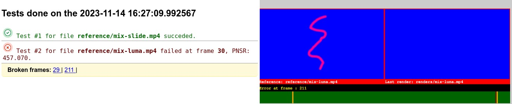

<!-- SPDX-FileCopyrightText: none
 SPDX-License-Identifier: CC0-1.0-->
# Kdenlive Test Suite

This repository is a work in progress. It hosts scripts to automatically render project files and compare them with a reference render to test for regressions.

To make these scripts useful, we refactored the Kdenlive rendering code to make it possible to render a project file from the command line (see [Kdenlive task 1615](https://invent.kde.org/multimedia/kdenlive/-/issues/1615)).

The repository currently only contains very basic assets and project files to this repository, as well as reference renderings, but you can easily add project files locally and run the scripts on your computer.

The testing is a 2 steps process:

- First script will open all the project files in the "projects" folder and render them in the "renders" folder. After all renderings are over, it will call the second script for comparison.

- Second script will compare the renders in "renders" folder produced in step 1 with "reference" renderings.

**Before cloning this repository, you must have git-lfs installed (git with large file support) since the reference renders are stored using lfs**

## Testing with your own project files
1. First, you need to save your project file or a copy of it in the **projects** subfolder
2. You need to render your full project in the **reference** subfolder
3. Call the render script: `start-renders.py`, with an optional path to a specific Kdenlive executable (see below)
4. This will output a web page presenting the results

## The scripts
**For step 1:**
`start-renders.py` will loop all project files in the `projects` folder and check if a rendered file already exists. In that case it will abort. Otherwise, it will render the project in the `renders` folder. When all renders are done, it will call the `compare-renders.py` script (step 2).
`start-renders.py` takes one optional argument, the path to the kdenlive binary, for example if you want to test rendering with a new Appimage, you can do:
`start-renders.py /path/to/Appimage`

**For step 2:**
`compare-renders.py` will check all existing renders in the `renders` folder and check if there is a matching name reference render. It will then pass the 2 files to the second script: `pnsr.py`
TODO: currently only video is compared, no check is made on audio

`pnsr.py` takes 3 arguments:

The reference render file
The newly rendered file
An incremental integer number describing the count of processed files

This script will then compare the 2 files using the FFmpeg pnsr filter, and detect inconsistensies. It will then output some html data that is then collected by the `compare-renders.py` script and displayed in an HTML page like below:

## Technical Requirements

If you want to contribute project files to become part of this test suite there are some technical requirements you need to satisfy.

Project files should have an empty `root` attribute in the `<mlt>` element. You can clean the attribute easily by running `python hooks/check-mlt-root.py --fix your.kdenlive`. It is recommended to install [https://pre-commit.com/](pre-commit) and run `pre-commit install` to setup pre-commit hooks to check for empty project roots automatically.

If you want use fonts in Title Clips etc. you should use the Noto Sans font as only this font is garantueed to be install on all plattforms of the CI system.
